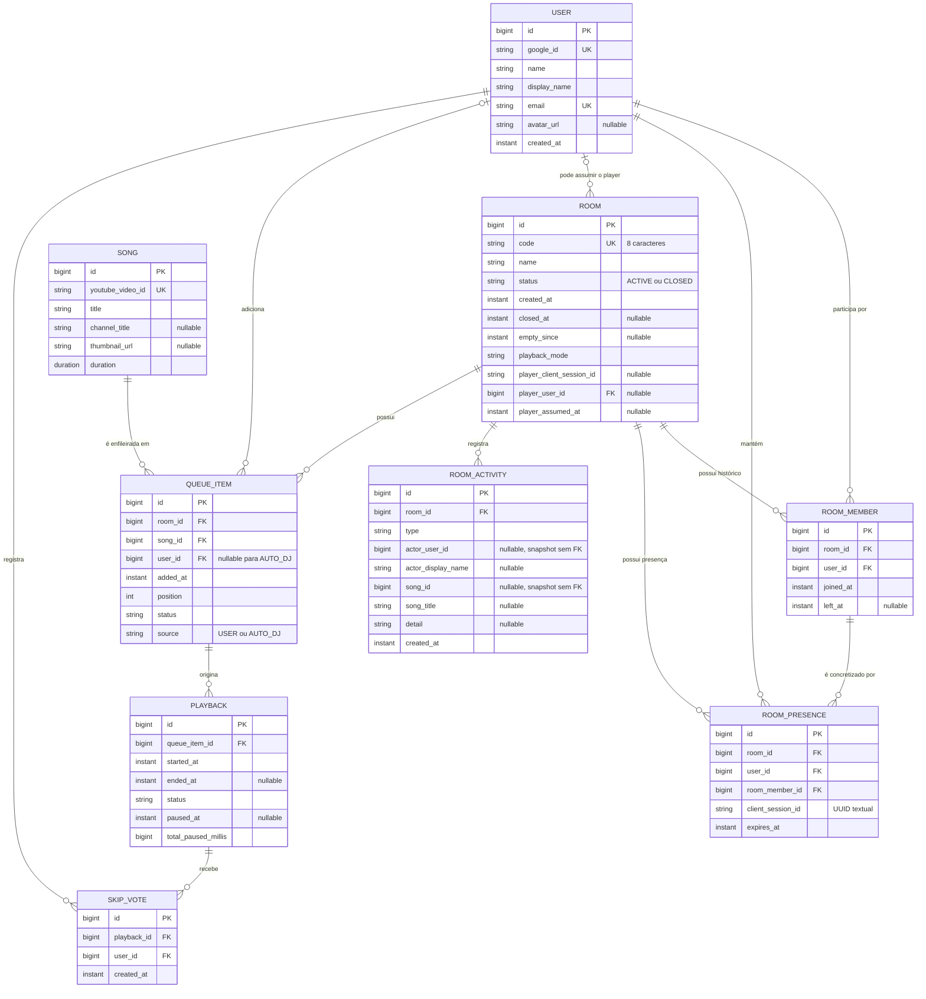

# Modelo de dados do Sintonia

O modelo persistente atual possui nove entidades JPA. PostgreSQL é a fonte de verdade para o estado compartilhado; conexões WebSocket e timers de reconnect permanecem transitórios no processo da aplicação.

## Diagrama entidade-relacionamento



## Entidades

### `User` → `users`

Representa a identidade interna vinculada ao Google.

- `google_id` é obrigatório e único.
- `email` é obrigatório e único.
- `name` armazena o nome completo recebido do provedor.
- `display_name` é obrigatório no schema final e pode ser alterado pelo usuário.
- `avatar_url` é opcional.
- `created_at` é preenchido na criação.

O ID interno é usado nas relações. O `google_id` identifica o principal externo e não é recebido livremente nos comandos da API.

### `Room` → `rooms`

Representa uma sala e também armazena o modo e o claim de player.

- `code` possui oito caracteres e é único.
- `name` é obrigatório no schema final.
- `status` usa `ACTIVE` ou `CLOSED`.
- `closed_at` é preenchido no encerramento definitivo.
- `empty_since` marca desde quando não há presença válida.
- `playback_mode` usa `TODOS_OS_NAVEGADORES` ou `CAIXA_DE_MUSICA`.
- `player_client_session_id`, `player_user_id` e `player_assumed_at` são preenchidos em conjunto enquanto existe um player.

O usuário do player é uma relação opcional. Um mesmo usuário pode, em princípio, possuir claims em salas diferentes; cada sala possui no máximo um player persistido.

### `RoomMember` → `room_members`

Registra um período histórico de participação de um usuário em uma sala.

- `room_id` e `user_id` são obrigatórios.
- `joined_at` é preenchido na criação.
- `left_at = null` representa um membership aberto.
- `left_at` é preenchido quando termina a última presença válida ligada ao período.

Podem existir vários memberships históricos para o mesmo par sala/usuário. A aplicação reutiliza o membership aberto e abre um novo período quando o usuário retorna depois de ter saído.

### `RoomPresence` → `room_presences`

Representa uma presença ativa por contexto de navegador.

- Relaciona obrigatoriamente sala, usuário e membership.
- `client_session_id` armazena um UUID textual com até 36 caracteres.
- `expires_at` implementa o lease renovado pelo heartbeat.
- A combinação `(room_id, user_id, client_session_id)` é única.

A presença, e não apenas `RoomMember.left_at`, define quem está ativo. Várias presenças do mesmo usuário são permitidas e continuam contando como um único participante.

### `RoomActivity` → `room_activities`

Registra a linha do tempo persistente da sala.

- `room_id`, `type` e `created_at` são obrigatórios.
- `actor_user_id` e `actor_display_name` são snapshots opcionais do ator.
- `song_id` e `song_title` são snapshots opcionais da música.
- `detail` contém informação textual adicional quando necessária.

`actor_user_id` e `song_id` são valores escalares, não chaves estrangeiras JPA. Isso permite preservar a atividade independentemente do carregamento ou evolução das entidades relacionadas.

Tipos atuais:

- `MEMBER_JOINED`
- `MEMBER_LEFT`
- `SONG_ADDED`
- `SONG_REMOVED`
- `ROOM_RENAMED`
- `PLAYBACK_STARTED`
- `PLAYBACK_FINISHED`
- `PLAYBACK_SKIPPED`

### `Song` → `songs`

Armazena metadados de um vídeo selecionado do YouTube.

- `youtube_video_id` é obrigatório e único.
- `title` e `duration` são obrigatórios.
- `channel_title` e `thumbnail_url` são opcionais.
- `duration` usa `java.time.Duration` no domínio.

O limite funcional de 20 minutos é aplicado pelo serviço, não por uma constraint SQL declarada.

### `QueueItem` → `queue_items`

Representa uma música incluída na ordem de uma sala.

- `room_id`, `song_id`, `added_at`, `position`, `status` e `source` são obrigatórios.
- `user_id` é obrigatório para `source = USER` e nulo para `source = AUTO_DJ` por regra da aplicação.
- `position` começa em 1 e define a ordem, com o ID usado como desempate nas consultas.
- `status` usa `WAITING`, `PLAYING`, `FINISHED`, `SKIPPED` ou `ERROR`.
- `source` usa `USER` ou `AUTO_DJ`.

Um índice parcial em `room_id`, filtrado por `status = 'PLAYING'`, impede mais de um item `PLAYING` por sala. Não há constraints SQL declaradas para unicidade de posição, música ativa ou limite individual de oito itens; essas regras são coordenadas transacionalmente pela aplicação.

### `Playback` → `playbacks`

Registra uma execução efetiva originada de um item de fila.

- `queue_item_id`, `started_at`, `status` e `total_paused_millis` são obrigatórios.
- `ended_at` é preenchido quando o playback termina.
- `paused_at` é preenchido durante uma pausa global.
- `total_paused_millis` acumula pausas já concluídas.
- `status` usa `PLAYING`, `FINISHED`, `SKIPPED` ou `ERROR`.

A posição lógica é calculada a partir dos timestamps e do tempo acumulado de pausa. O mapeamento atual não declara constraint única em `queue_item_id` nem índice parcial de playback ativo; a máquina de estados e o item `PLAYING` da fila coordenam essa consistência.

### `SkipVote` → `skip_votes`

Registra o voto de um usuário para pular um playback.

- `playback_id`, `user_id` e `created_at` são obrigatórios.
- A combinação `(playback_id, user_id)` é única.

A quantidade necessária para pular é calculada em tempo de execução com base nos usuários que possuem presença válida.

## Constraints e índices explícitos

| Nome | Tabela | Regra |
|---|---|---|
| `uk_users_google_id` | `users` | `google_id` único |
| `uk_users_email` | `users` | `email` único |
| `uk_rooms_code` | `rooms` | `code` único |
| `uk_room_presences_room_user_client` | `room_presences` | uma presença por sala, usuário e sessão |
| `uk_songs_youtube_video_id` | `songs` | vídeo do YouTube único |
| `uk_skip_votes_playback_user` | `skip_votes` | um voto por usuário e playback |
| `ux_queue_items_playing_per_room` | `queue_items` | no máximo um item `PLAYING` por sala |
| `ix_room_presences_expires_at` | `room_presences` | acelera expiração de leases |
| `ix_room_presences_client_session_id` | `room_presences` | acelera busca por sessão de navegador |

## Máquinas de estado

### Sala

```text
ACTIVE -> CLOSED
```

`CLOSED` é terminal. `empty_since` controla a espera de 20 minutos, mas não é um status adicional.

### Item de fila

```text
WAITING -> PLAYING -> FINISHED
                   -> SKIPPED
                   -> ERROR
```

Um item `WAITING` também pode ser removido fisicamente pelo próprio autor antes de iniciar. A fila exposta pela API contém apenas `WAITING`; `PLAYING` é apresentado pelo playback atual.

### Playback

```text
PLAYING -> FINISHED
        -> SKIPPED
        -> ERROR
```

Pausa não é um status separado: `paused_at != null` representa um playback `PLAYING` globalmente pausado.

## Estado persistente e estado transitório

Persistido no PostgreSQL:

- autenticação interna do usuário;
- salas e claim atual de player;
- memberships e leases de presença;
- atividades;
- catálogo selecionado;
- fila, playbacks e votos.

Transitório no processo/navegador:

- conexões WebSocket/STOMP;
- associação das conexões ao `clientSessionId`;
- timer de tolerância de 15 segundos após desconexão do player;
- timer de reconnect STOMP do frontend;
- estado local do YouTube IFrame Player.

O `clientSessionId` aparece tanto no estado persistido quanto no transitório para correlacionar uma aba/janela, mas não é credencial e não substitui a sessão HTTP autenticada.

## Inicialização do schema

- O Hibernate está configurado com `spring.jpa.hibernate.ddl-auto=update`.
- O `schema.sql` é executado na inicialização e complementa o schema com o índice parcial de fila, índices de presença, colunas de pausa e ajustes de nulabilidade usados pelas versões atuais.
- O modelo depende de recursos do PostgreSQL, em especial o índice parcial por status.
